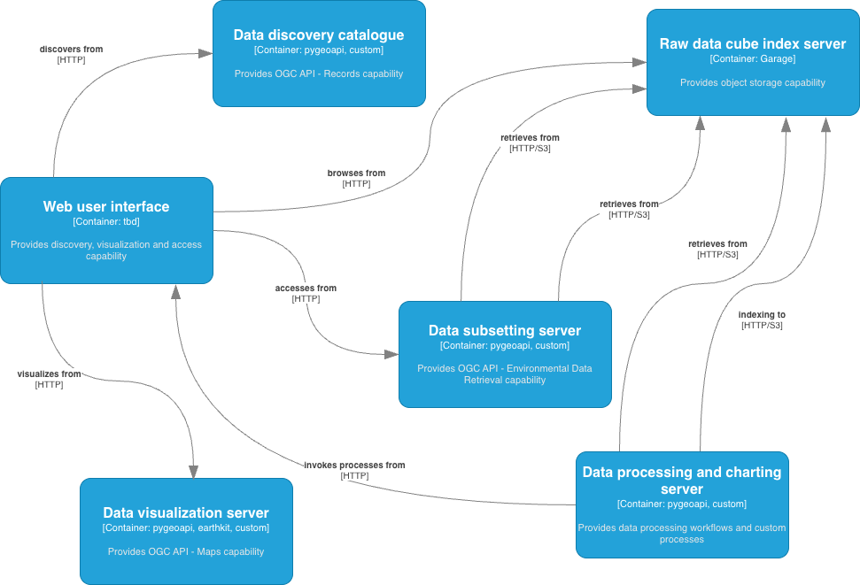

# metdx-demo

SG-FIT [WMO Met Data Exchange Interoperability Experiment](https://wmo-im.github.io/metdx-ie) demonstrator

- [@6a6d74](https://github.com/6a6d74)
- [@tomkralidis](https://github.com/tomkralidis)
- [@jameshawkes](https://github.com/jameshawkes)
- [@awarde96](https://github.com/awarde96)
- [@m-burgoyne](https://github.com/m-burgoyne)
